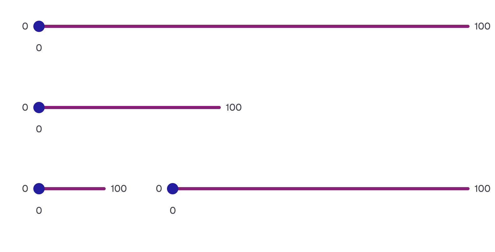
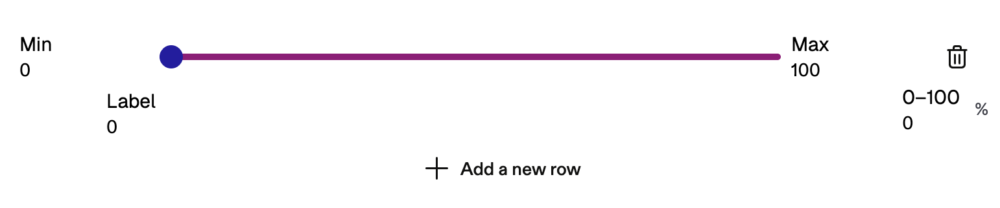
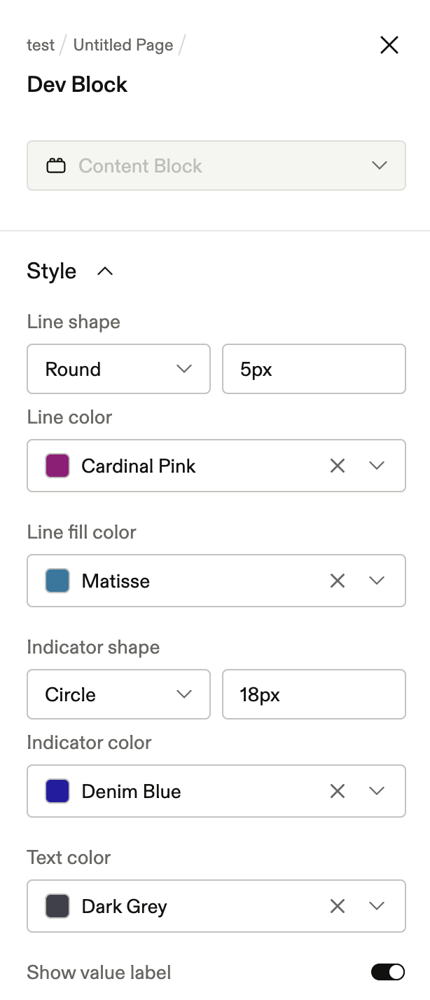

# Range Slider Block

A Frontify guideline block that renders one or more interactive range sliders. Editors drag a handle along a styled track and see the chosen value update live. Each slider row has optional min/max endpoint labels, an inline text label, and a numeric percentage input — all configurable without leaving the page.



---

## Features

| Feature            | Detail                                                         |
| ------------------ | -------------------------------------------------------------- |
| Multiple rows      | Add or remove slider rows in edit mode                         |
| Min / Max labels   | Free-text endpoint labels per row                              |
| Inline label       | Optional descriptor shown beneath the track                    |
| Value label toggle | Show/hide the live percentage below the handle                 |
| Direct % input     | Type a number (0–100) in edit mode to jump the handle          |
| Line style         | Round or Square ends; height up to 90 px; fully branded colour |
| Fill colour        | Separate colour for the filled (active) portion of the track   |
| Indicator style    | Circle, Square, or Bar handle; independent size and colour     |
| Text colour        | Single colour applied to all labels and endpoint text          |

### Edit mode

In edit mode each row exposes inline `Min` / `Max` text inputs, a `Label` field, a `0–100` percentage input, and a delete button. A global **Add a new row** button appends a fresh slider at the default value of 50.



### Style panel

All visual settings live in the Frontify sidebar under **Style**: line shape + height + colour, fill colour, indicator shape + size + colour, text colour, and the value-label toggle.



---

## Prerequisites

- Node.js 22 (see `.nvmrc`; run `nvm use` to switch automatically)
- A Frontify account with a guideline page you can edit (for live testing)
- `@frontify/frontify-cli` — installed as a dev dependency; no global install required

---

## Local development

```bash
npm install
npm run serve
```

`frontify-cli serve` starts a local dev server and hot-reloads the block inside Frontify. Open the Frontify guideline page, add a **Dev Block**, and point it at the local server URL printed in the terminal.

Other commands:

```bash
npm run typecheck   # TypeScript check, no emit
npm run lint        # ESLint
npm run lint:fix    # ESLint with auto-fix
npm run deploy      # Publish to Frontify
```

---

## Testing in Frontify

1. Run `npm run serve` and copy the local server URL.
2. In Frontify, open a guideline page in edit mode.
3. Add a content block → choose **Dev Block** → paste the local URL.
4. The block loads live. Changes to `src/` hot-reload without a page refresh.
5. Use the sidebar **Style** panel to verify all styling options.

---

## Dependency notes

**`zustand` is not imported directly in `src/`.** It is listed under `peerDependencies` because `@frontify/fondue` pulls it in transitively via `@frontify/fondue-rte` → `@udecode/plate-core`, and the host app must share a single instance. Removing it can cause version conflicts at runtime even though no import appears in this codebase.
